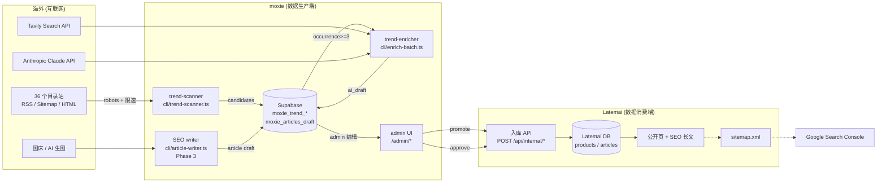
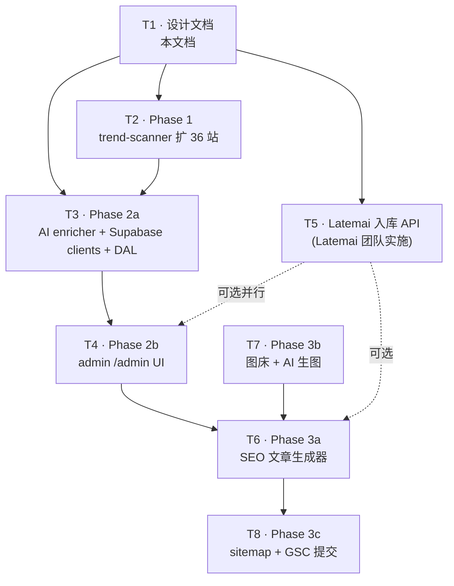

# Latemai 数据同步系统 · 设计文档

| 字段 | 值 |
|---|---|
| **task** | `task:#T1`（rd.sdtads.com） |
| **标题** | [T1 5/27] Latemai 现状评估 + Phase 1-3 设计文档 |
| **Owner** | 何安 |
| **Reviewer** | 邓晖 |
| **创建** | 2026-05-27 |
| **版本** | 0.1（初稿） |
| **配套 PRD** | `Latemai_Data_Sync_PRD.md`（外部，包内未存） |

---

## 0. TL;DR

把海外 36 个公开行业目录站（producthunt / fazier / launch.cab / …）当作 SaaS 早期信号源，
通过**抓取 → 跨站频次去重 → AI 补全中文产品卡片 → admin 审核 → 入库 Latemai 产品库 / 文章页**的
全流水线，自动给 Latemai 持续注入产品内容和 SEO 文章，构建"数据飞轮 → SEO 自然流量 → 转化"的闭环。

本文产出三件事：

1. 现状评估 + Gap 清单（§2）
2. 入库 API 规范（§4）—— 给 Latemai 后端的实施依据
3. Phase 1-3 任务清单 + 依赖图（§5）—— 给 rd.sdtads.com 拆 task 用

---

## 1. 概述

### 1.1 目的

PRD 提出"在自动化的产品数据池与内容生态系统"。本设计文档把 PRD 落到代码动作：

- 明确**两个仓库的边界**：moxie（数据生产端）vs Latemai（数据消费端 / 用户站）
- 明确**两端如何对接**：HTTP API（§4）
- 把 PRD 的三大阶段拆成**可单独立项的 task**（§5）
- 标出**合规红线**（§6）—— 不踩 robots.txt / 数据保留边界 / AI 不编

### 1.2 项目边界

| 项目 | 仓库 | 部署 | 角色 |
|---|---|---|---|
| **moxie** | `Michael00911/moxie` | GitHub Actions + 内部 CLI | 数据生产端：抓取 + AI 补全 + admin 审核 |
| **Latemai** | （内部项目，与 moxie 同团队维护） | `www.latemai.com` | 数据消费端：产品库 / 详情页 / 文章页 / 用户层 |

> 备注：moxie 当前 Supabase 项目（`sqvohgcwzhhsvkmyesvs`）和 latemai.com 的部署目前**实际上**指向同一个 Next.js app（看 git log "OAuth 写死 www.latemai.com"），这是历史遗留。本设计**仍把它们视为两个项目**，原因：
>
> 1. 这是 PRD 的原始定位
> 2. 让生产端的合规风险（爬虫被封 IP / robots 违规）与用户站隔离
> 3. 后续允许 Latemai 用另一个团队 / 框架重写而不影响 moxie

### 1.3 关键术语

| 术语 | 定义 |
|---|---|
| **候选 (candidate)** | trend-scanner 从目录站抓出的"在该站出现的工具 URL + name_hint"，存 `moxie_trend_candidates` |
| **草稿 (draft)** | AI 补全产生的中文产品卡片，存 `moxie_trend_drafts`，未通过审核前不进 Latemai |
| **product_key** | 跨站去重 key，从产品名归一化得出（例如 "Cursor AI" → `cursor-ai`） |
| **promote** | admin 审核通过、把 draft 写入 Latemai 产品库的动作 |
| **occurrence_count** | 一个 candidate 在多少个不同目录站出现过 —— 信号强度的核心指标 |
| **入库 API** | Latemai 暴露给 moxie 的 HTTP API，让 moxie 把已审核的产品/文章推到 Latemai |

---

## 2. 现状评估 (AC-2)

### 2.1 moxie 仓库现状

#### 2.1.1 技术栈
- Next.js 16.2.5 + React 19.2.4 + Tailwind v4
- Supabase (auth + DB + storage + RLS)
- TypeScript（主项目）+ JS（legacy HTML）+ Node CLI（`cli/`）
- 部署：Vercel

#### 2.1.2 已有数据库（Supabase migrations 001 + 003）
- `moxie_categories`（分类，10 个种子）
- `moxie_products`（产品，12 个种子）
- `moxie_articles`（文章，4 个种子）
- `moxie_comments` / `moxie_votes`（用户互动）
- `moxie_profiles`（用户角色 admin/user）
- `moxie_trend_candidates` / `moxie_trend_sources` / `moxie_trend_scan_runs`（爬虫数据池，已有 schema）

#### 2.1.3 已有功能
- 公开页（`src/app/*` + legacy `moxie-*.html`）
- Auth（GitHub OAuth + Google OAuth + magic link，PKCE）
- CLI 工具 `cli/index.js`（`moxie list/search/get` —— 给外部 AI Agent 接入）
- **trend-scanner 雏形**（`cli/trend-scanner.js` 290 行）：
  - 4 个真 RSS 源：producthunt / launch.cab / marketingdb.live / neeed.directory
  - 跨站去重 + 频次计数 + scan_runs 审计
  - GitHub Actions cron 每周一跑一次
- Admin 角色（`moxie_is_admin()` RLS function）—— 但**没有任何 admin UI**，需要 Supabase Studio 手改

### 2.2 Latemai 网站现状

- 部署：`www.latemai.com`，Vercel
- 已可访问：产品库 / 分类页 / 详情页（实际由 moxie 的 Next.js app 渲染）
- **无对外 API**（除 Supabase REST + anon key）
- 文章页：表 `moxie_articles` 存在，但**没有"发图文长文"的 CMS 流程**

### 2.3 PRD ↔ 现状 Gap 清单

| PRD 模块 | PRD 要求 | 现状 | Gap |
|---|---|---|---|
| **§2.1** 37 目录站抓取 | producthunt / fazier / launch.cab / … 共 37 个 | 4 个 RSS 源 | 缺 32 个 HTML scraper（PRD 文本数 37 实际只列 36） |
| **§2.1** 合规 | 遵守 robots.txt + 限速 + UA | 仅有 UA header | 缺 robots.txt 解析 + per-domain rate limit |
| **§2.2.1** 跨站 dedupe | 按产品名 / 官网 URL 去重 | `product_key` schema 已就位 | ✓ |
| **§2.2.2** AI 补全 | 中文 tagline / description / 分类 / 定价 / 国内可用性 / 创始人 | 无 | 全缺：缺 Claude 调用、缺 prompt、缺 Tavily 联网、缺 `moxie_trend_drafts` 表 |
| **§2.2.2** 手动校验后台 | 专门管理后台供人工修润 + 添加深度见解 | 无（仅 Supabase Studio） | 缺 `/admin/*` Next.js 页面 |
| **§2.3** 同步到 Latemai 产品库 | 自动写入 Latemai 产品分类系统 | 因为目前 moxie ≈ Latemai，直接写 `moxie_products` 即可 | **若两端真正拆开**：缺入库 API + token 认证 |
| **§2.3** 同步到 Latemai 文章页 | 自动更新文章 | 同上 | 同上 |
| **§3.1** SEO 文章自动生成 | 事件驱动 / 定时驱动 + 文字 + 配图 | 无 | 全缺：缺生成器、缺图床、缺 CMS 接口 |
| **§3.2** Latemai 文章 CMS | 若没有需在本项目实现 | `moxie_articles` 表存在但没"发文章"前端流程 | 缺：admin 编文章页 + meta/canonical/alt 自动填 + sitemap 更新 + GSC URL ping |
| **§4** 接口设计 | Latemai 提供入库 API + Token 验证 | 无 | 见 §4 |
| **§4** 反爬虫合规 | 严格遵守 robots / Rate Limit / 分布式 IP | UA 声明 + 单机跑 | 缺合规层 |
| **§4** 前端渲染优化 | SSR/ISR + Schema Markup | Next.js 已是 SSR；Schema Markup 缺 | 缺 JSON-LD |

### 2.4 已识别的"PRD 漏洞"

调研 PRD 过程中发现几处需要确认的点：

1. **PRD 写 37 站，实际只列 36 个**（其中 `everfeatured` 无后缀，需确认是 `.com` 还是别的 TLD）
2. **PRD 未明确 Latemai 是否独立于 moxie 部署**（决定要不要做入库 API 还是直写 DB）
3. **PRD §3 文章配图来源**：截图 / AI 生图 / 图表，未给优先级和图床方案
4. **PRD §4 "分布式或动态代理"** 没指定 provider —— 是 BrightData？ScraperAPI？还是简单 ProxyMesh？影响成本
5. **PRD 未提"重跑某 candidate"机制** —— admin 觉得 AI 草稿质量差时怎么重跑？本设计在 §5.4 补

这些待 §5.6 之前跟邓晖对齐。

---

## 3. 架构设计

### 3.1 系统组件图



### 3.2 数据流（端到端示例）

以"发现新产品 → 上架 Latemai"为例：

1. **T+0**：trend-scanner 每天 UTC 00:00 跑批，从 producthunt feed 抓到 `Cursor AI` → 写 `moxie_trend_candidates` 一行（occurrence=1）
2. **T+1d**：launch.cab feed 也出现 Cursor AI → trigger 跨站频次 +1 → occurrence=2
3. **T+2d**：fazier 首页 HTML 抓出 Cursor AI 官网 → occurrence=3
4. **T+2d UTC 04:00**：trend-enricher 看到 occurrence≥3，调 Tavily 搜 "Cursor AI cursor.com" → 拿到 3 篇网页摘要 → 喂 Claude → 生成中文产品卡片 → 写 `moxie_trend_drafts`
5. **T+2d 业务时间**：admin 在 `/admin/candidates` 看到 "Cursor AI" 草稿 → 点开 → 编辑 tagline / 改分类 / 微调 description → 点 "Promote"
6. **promote action**：moxie 调 Latemai 入库 API `POST /api/internal/products` 推 payload → Latemai 写入产品库
7. **T+2d+1m**：Latemai sitemap.xml 自动重生 → 触发 GSC URL 索引请求 → 上架完成

整个流程**对人类只有一步**（admin 在 `/admin/candidates/[id]` 点 Promote），其余全自动。

### 3.3 部署拓扑

| 组件 | 运行环境 | 触发 |
|---|---|---|
| trend-scanner | GitHub Actions runner | cron `0 0 * * *` |
| trend-enricher | GitHub Actions runner | cron `0 4 * * *`（晚 scanner 4h） |
| SEO writer (Phase 3) | GitHub Actions runner | cron `0 8 * * *` + admin 手动 |
| admin UI | Vercel (Next.js SSR) | HTTP request |
| moxie DB | Supabase (托管) | 始终在线 |
| Latemai 入库 API | 由 Latemai 团队部署（推测 Vercel + serverless） | HTTP |
| Latemai DB | 由 Latemai 团队管理 | 始终在线 |

---

## 4. 入库 API 规范 (AC-3)

> 这一节是给 **Latemai 后端** 的实施依据。moxie 端按此规范调用。

### 4.1 认证（Token）

| 项 | 规范 |
|---|---|
| 认证方式 | `Authorization: Bearer <token>` HTTP header |
| Token 类型 | 长 token（≥ 64 字符），不过期，但可 rotate |
| 生成 | Latemai 后端在内部管理后台生成；moxie 端从 GitHub Actions secret / Vercel env 读 |
| 环境变量名 | moxie 端：`LATEMAI_SYNC_TOKEN`；Latemai 端：`SYNC_API_TOKEN`（验证用） |
| Rotate 策略 | 季度轮换或泄露时立即换；旧 token 在新 token 生效后保留 24h grace |
| 失败响应 | `401 Unauthorized`（缺 token） / `403 Forbidden`（token 无效） |

> Token 不能放在 URL query string —— 会写进 Vercel access log。

### 4.2 端点清单

| Method | Path | 用途 | 调用频率 |
|---|---|---|---|
| `GET` | `/api/internal/health` | 健康检查 | moxie 每次跑批前先 ping |
| `POST` | `/api/internal/products` | 推送一个（已审核的）产品到 Latemai 产品库 | 每次 admin promote 触发 |
| `POST` | `/api/internal/articles` | 推送一篇（已生成或人审过的）SEO 文章 | Phase 3，每天 5-20 次 |
| `PATCH` | `/api/internal/products/{slug}` | 更新已存在产品（重测过、改定价、改分类） | admin 编辑既有产品时触发 |
| `GET` | `/api/internal/products/{slug}` | 反查 Latemai 上某 slug 是否已存在 | promote 前幂等校验 |

### 4.3 字段定义

#### 4.3.1 `POST /api/internal/products`

```jsonc
// Request body
{
  "slug": "cursor-ai",                         // 必填，[a-z0-9-]+，30 字符内，URL 路径
  "name": "Cursor AI",                         // 必填，≤ 60 字
  "domain": "cursor.com",                       // 必填，主域名（用于 favicon / 跳转）
  "tagline": "AI 原生 IDE，Claude / GPT 双引擎",  // 必填，≤ 30 字
  "description": "...",                         // 必填，200-500 字纯文本（不含 HTML）
  "category_slug": "ai-coding",                 // 必填，必须是 Latemai 已有 category slug
  "tags": ["编程", "IDE", "Claude"],            // 必填，3-5 个，每个 ≤ 8 字
  "price_label": "$20/月",                      // 必填，自由文本（不强制枚举，但 moxie 端会用枚举）
  "domestic_available": "partial",              // 必填，yes / partial / no
  "data_overseas": true,                        // 选填，数据是否出境（合规标签）
  "key_features": ["代码补全", "...", "..."],   // 选填，3-5 条
  "target_users": "...",                        // 选填，≤ 50 字
  "founder_info": null,                         // 选填，string 或 null
  "source": {                                    // 必填，溯源
    "moxie_candidate_id": 1234,
    "moxie_draft_id": 5678,
    "ai_model": "claude-opus-4-7",
    "ai_generated_at": "2026-05-27T04:12:00Z",
    "promoted_by_user_id": "uuid-of-admin",
    "occurrence_count": 5,
    "source_sites": ["producthunt.com", "launch.cab", "fazier.com"]
  },
  "idempotency_key": "promote-draft-5678-2026-05-27"  // 必填，幂等键（≤ 128 字符）
}

// Success Response 201 Created
{
  "ok": true,
  "product": {
    "id": 12345,
    "slug": "cursor-ai",
    "url": "https://www.latemai.com/p/cursor-ai",
    "created_at": "2026-05-27T08:00:00Z"
  }
}

// Idempotent Replay Response 200 OK（同 idempotency_key 再调）
{
  "ok": true,
  "product": { "id": 12345, ... },
  "replay": true                                // 标记这是重放，非新建
}
```

#### 4.3.2 `POST /api/internal/articles`（Phase 3）

```jsonc
{
  "slug": "deepseek-v3-vs-claude-2026-q2",
  "title": "DeepSeek V3 中文实测：3 个 Claude 没有的优势",
  "excerpt": "...",                              // ≤ 150 字
  "body_html": "<h2>...</h2>...",                // 富文本 HTML（已经清洗过 XSS）
  "cover_url": "https://...",                    // CDN URL 或图床
  "category": "横评",                            // 枚举：横评 / 手册 / 增长 / 选型
  "tags": ["DeepSeek", "Claude", "实测"],
  "read_minutes": 8,
  "related_product_slugs": ["deepseek-v3", "claude-3.5-sonnet"],
  "seo": {                                       // meta tags（Latemai 自动填进 <head>）
    "meta_title": "...",
    "meta_description": "...",
    "canonical": "https://www.latemai.com/blog/...",
    "og_image": "..."
  },
  "source": {
    "moxie_article_draft_id": 99,
    "ai_model": "claude-opus-4-7",
    "ai_generated_at": "...",
    "trigger": "scheduled",                       // scheduled / event-driven / manual
    "approved_by_user_id": "uuid"
  },
  "idempotency_key": "publish-article-99-2026-05-27"
}
```

### 4.4 错误码

| HTTP | error.code | 含义 | moxie 端动作 |
|---|---|---|---|
| 400 | `INVALID_PAYLOAD` | 字段缺失 / 长度超限 / 枚举不对 | 不重试，记 `sync_errors` 表，alert admin |
| 400 | `UNKNOWN_CATEGORY_SLUG` | `category_slug` 在 Latemai 没注册 | 同上 |
| 400 | `SLUG_FORMAT` | slug 不符合 `^[a-z0-9-]+$` | 同上 |
| 401 | `MISSING_TOKEN` | 缺 `Authorization` header | 不重试，立即报警 |
| 403 | `INVALID_TOKEN` | token 无效或已撤销 | 不重试，立即报警，标记 sync 暂停 |
| 409 | `SLUG_CONFLICT` | slug 在 Latemai 已存在（且 idempotency_key 不同） | 让 admin 决定改 slug 或合并；不重试 |
| 422 | `VALIDATION_FAILED` | 业务校验失败（如 description 含禁用词） | 记日志，alert admin |
| 429 | `RATE_LIMITED` | 触发限流 | 退避重试（exponential backoff，最多 5 次） |
| 500 | `INTERNAL_ERROR` | Latemai 内部错 | 退避重试 |
| 503 | `MAINTENANCE` | Latemai 正在升级 | 退避重试 |

Error response body 通用 shape：

```jsonc
{
  "ok": false,
  "error": {
    "code": "INVALID_PAYLOAD",
    "message": "tagline 超过 30 字符限制",
    "field": "tagline",                        // 选填
    "request_id": "req_abc123"                  // 选填，便于 Latemai 端日志关联
  }
}
```

### 4.5 限流 + 幂等性 + 安全

| 项 | 规范 |
|---|---|
| 限流（Latemai 端） | 100 req/min per token；超限返 429 + `Retry-After` header |
| 幂等性 | 每个 POST 必须带 `idempotency_key`；Latemai 端缓存 7 天，期间重复请求返 200 OK + `replay: true` |
| HTTPS | 强制；HTTP 直接 308 重定向到 HTTPS |
| 请求体大小 | 每次 ≤ 1 MB（article body_html 可能较大但应在此限内） |
| 速率审计 | Latemai 端记录每次 sync 请求到 `sync_audit_log` 表，含 token_id / payload_hash / status / latency_ms |
| 失败重试 | moxie 端：429/5xx 用指数退避（1s, 2s, 5s, 15s, 60s），共 5 次；其他错误不重试 |
| Webhook（未来） | Latemai 可选反向 webhook 通知 moxie："产品被用户举报"、"文章被删除" 等 |

---

## 5. Phase 1-3 任务清单 + 依赖图 (AC-4)

### 5.1 依赖图



> **可选并行** 边：T4（admin UI）和 T5（Latemai 入库 API）可以并行做。早期 admin UI 可以直接写 `moxie_products`（同 DB）跑通；后续切换到走 T5 的 API。

### 5.2 Phase 1: trend-scanner 扩展

#### T2: 扩 trend-scanner 至 36 目录站 + TS 重构 + 合规层

| 字段 | 值 |
|---|---|
| **AC-1** | `cli/trend-scanner.ts` 替换原 `.js`；TS 编译过 |
| **AC-2** | 36 个源全跑通（容忍单站抓 0 条，但全站 fetch + parse 不抛错） |
| **AC-3** | robots.txt 解析 + per-domain ≥5s 限速生效（手测：连续 fetch 同域名间隔 ≥ 5s） |
| **AC-4** | dry-run 验证：36/36 sources OK，候选总数 ≥ 500 |
| **AC-5** | GitHub Actions `trend-scanner.yml` 改成每日 UTC 00:00 |
| **AC-6** | `cli/README.md` 加 "Trend Scanner" 章节列 36 源 + 合规说明 |
| **预估净代码** | 1200-1400 行 |
| **依赖** | T1 |

#### T2.1（可选小 task）：trend-scanner 切换到分布式代理

> PRD §4 要求"分布式或动态代理 IP"，但当前 GHA runner 单 IP。  
> 优先级 P2，等 T2 跑 2 周后看是否真的被某些站封 IP。  
> 候选 provider：ScraperAPI / BrightData / Oxylabs。预算待与邓晖对齐。

### 5.3 Phase 2a: AI enricher + 数据基础设施

#### T3: AI enricher worker + Supabase 客户端 + DAL

| 字段 | 值 |
|---|---|
| **AC-1** | 新表 `moxie_trend_drafts`（migration 跑通） |
| **AC-2** | `cli/enricher/*` 完整：types / tavily / claude / prompt / enrich |
| **AC-3** | `cli/enrich-batch.ts` 跑通：取 occurrence≥3 候选 → Tavily 搜 → Claude 生草稿 → 入库 |
| **AC-4** | 用 `claude-opus-4-7` 模型，`output_config.format = json_schema` 强制结构化 JSON |
| **AC-5** | 限速：每 candidate 间隔 ≥ 1.2s（≤ Anthropic tier 1 50RPM） |
| **AC-6** | `src/lib/supabase/{server,admin,types}.ts` + `src/lib/admin/auth.ts` 写好 |
| **AC-7** | 新 GHA `trend-enricher.yml`，cron `0 4 * * *` |
| **AC-8** | 干跑 / 试跑 3 条，验证 AI 输出：tagline 中文 + ≤ 30 字 + 真实判断 `domestic_available` |
| **预估净代码** | 1200-1400 行 |
| **依赖** | T1 + T2（候选池得先有数据） |
| **新 secret** | `ANTHROPIC_API_KEY` + `TAVILY_API_KEY` |

### 5.4 Phase 2b: admin 审核 UI

#### T4: /admin Next.js 后台

| 字段 | 值 |
|---|---|
| **AC-1** | 路由：`/admin/login`（magic link）/ `/admin`（仪表盘）/ `/admin/candidates`（列表）/ `/admin/candidates/[id]`（详情+编辑+Promote/Reject） |
| **AC-2** | 路由组 `(authed)` 守卫：未登录 / 非 admin redirect 到 `/admin/login` |
| **AC-3** | 双 Supabase client：anon (server.ts cookie-based) 验身份；service_role (admin.ts) 写库绕 RLS |
| **AC-4** | Server Actions：saveDraft / promoteToProduct / rejectDraft，入口必 `await requireAdmin()` |
| **AC-5** | DAL `getCurrentAdmin()` 用 React `cache()` 做请求级 memoization |
| **AC-6** | `.env.local.example` 文档化 3 个新 env vars，`.gitignore` 白名单 example |
| **AC-7** | `next build` 注册 5 个 `/admin/*` 路由全是 SSR Dynamic |
| **AC-8** | typecheck 0 错误 |
| **AC-9**（增加）| 详情页加 "重跑 AI 补全" 按钮 —— 调用 enricher 重新生成一版 draft（写入新行，保留历史） |
| **预估净代码** | 1100-1300 行（不含 AC-9 的"重跑"功能，那需另开小 task） |
| **依赖** | T3 |
| **新 env** | `NEXT_PUBLIC_SUPABASE_URL` / `NEXT_PUBLIC_SUPABASE_ANON_KEY` / `SUPABASE_SERVICE_ROLE_KEY` |
| **新 secret** | 上述 env 加到 Vercel；Supabase auth 加 `https://www.latemai.com/admin/auth/callback` redirect URL |

#### T4.1（可选小 task）：重跑 AI 补全按钮

| 字段 | 值 |
|---|---|
| **AC-1** | `/admin/candidates/[id]` 加按钮 "重跑 AI" |
| **AC-2** | Server Action 调用 `CandidateEnricher.enrichOne()` 生成新 draft，写新行（不覆盖旧的） |
| **AC-3** | 详情页能切换显示历史 draft 版本 |
| **预估净代码** | 200-400 行 |
| **依赖** | T4 |

### 5.5 Phase 3: SEO 文章自动化

#### T6: SEO 文章生成器（事件驱动 + 定时驱动）

| 字段 | 值 |
|---|---|
| **AC-1** | 新表 `moxie_articles_drafts`（标题 / 摘要 / body_html / meta / 状态） |
| **AC-2** | `cli/article-writer.ts` 工具：给定主题 + 相关产品 list → 调 Claude → 生成中文长文（800-2000 字） |
| **AC-3** | 触发：定时（每天扫"新 promote 的产品"产生横评类标题）+ 事件（admin 在 UI 点"为这 3 个产品生成横评"） |
| **AC-4** | 字段质量：H1/H2/H3 层级清晰；长尾关键词嵌入；meta_title / meta_description 自动生成 |
| **AC-5** | 入库走 Latemai 入库 API `POST /api/internal/articles`（若 T5 已完成）或直接写 DB（若 T5 未完成） |
| **预估净代码** | 1100-1400 行 |
| **依赖** | T4 + (T5 或直写 DB) |

#### T7: 图床 + AI 生图

| 字段 | 值 |
|---|---|
| **AC-1** | 选定图床（候选：Supabase Storage / Cloudinary / Bunny） |
| **AC-2** | 三种配图源接通：（a）截 Landing Page —— 用 Playwright （b）AI 生图 —— Replicate 或 DALL-E （c）从产品库现有图拼图 |
| **AC-3** | 每张图自动加 alt text（中文 SEO） |
| **AC-4** | 图片 URL 写入 article draft 的 cover_url 字段 |
| **预估净代码** | 800-1200 行（可能不到 1000，需评估是否合并到 T6） |
| **依赖** | T1（决策图床 provider 待跟邓晖对齐） |

#### T8: sitemap.xml + Google Search Console 提交

| 字段 | 值 |
|---|---|
| **AC-1** | Latemai 端：sitemap.xml 动态生成（Next.js `sitemap.ts`），包含所有产品 + 文章 URL |
| **AC-2** | 文章发布后自动调 GSC URL Inspection API 提交索引请求 |
| **AC-3** | GSC service account credential 配 Vercel env |
| **AC-4** | 实现 schema.org JSON-LD（Product + Article + BreadcrumbList） |
| **预估净代码** | 800-1100 行 |
| **依赖** | T6 |

### 5.6 任务工作量估算

| Task | 估算工时 | 估算净代码 | 风险 |
|---|---|---|---|
| T1 设计文档（本文） | 4-6h | ~700 行 markdown | 纯文档 PR 撞 void 规则，需邓晖判定 |
| T2 Phase 1 scanner | 8-12h | 1260 行 | 33 个 HTML 站启发式提取质量参差 |
| T3 Phase 2a enricher | 10-14h | 1280 行 | AI 输出质量需要 prompt 调优迭代 |
| T4 Phase 2b admin UI | 12-16h | 1180 行 | Supabase cookie auth 与 legacy localStorage auth 共存 |
| T4.1 重跑按钮 | 3-4h | 300 行 | 低 |
| T5 Latemai 入库 API | （并入 moxie 仓库，由内部团队实施） | — | 跟邓晖对齐排期 |
| T6 SEO writer | 12-16h | 1200 行 | 中文 SEO 长文质量；图文搭配 |
| T7 图床 + 生图 | 8-12h | ~900 行 | 图床 provider 决策 + 成本 |
| T8 sitemap + GSC | 6-10h | 900 行 | GSC API 配额 |

**总计**：moxie 端 4-5 周（按 1 人全职），Latemai 端 1 周（接口实现）。

---

## 6. 合规边界

### 6.1 数据采集合规

| 项 | 规范 |
|---|---|
| robots.txt | 抓任何域名前先 fetch `/robots.txt`，缓存 24h；任何 `Disallow: /` 或匹配路径**立即跳过**该站，记入 `scan_runs.source_errors` |
| 限速 | 同一域名两次请求间隔 ≥ 5 秒 + ±2 秒抖动 |
| UA | `Mozilla/5.0 (compatible; MoxieTrendScanner/1.0; +https://latemai.com/install/agent.md)` —— 透明可联系 |
| 数据保留 | 只存"事实数据"：归一化 URL + 来源站名 + name_hint（≤ 60 字符）。**不存** 目录站的原文 description / 评论 / 排名内容 |
| 法律依据 | 工具名 + 官网 URL 是公开事实，不受版权保护；只是把"在 N 个站出现过"的频次信号聚合，不重发布原内容 |
| 站点禁止后处理 | 若任何站点 owner 通过邮件/告知函要求停止抓取，**立即在 `sources.ts` 给该源 `enabled: false`**，保留注释 |
| 频率 | 每天 1 次跑批，每个目录站每天最多被请求 ~5 次（首页 + 可能的 listing 页） |

### 6.2 AI 输出合规

| 项 | 规范 |
|---|---|
| `domestic_available` 实事求是 | yes/partial/no 必须基于客观判断；拿不准时优先 `partial`，**不给中国用户错误的"完全可用"信号** |
| `price_label` 不编造 | 必须从 6 个枚举里选（`免费 / 订阅 / 按量 / 邀请制 / 免费+订阅 / 不详`）；没把握就 `不详` |
| 不编造功能 | prompt 明确指示"搜索摘要里没明确说的，从保守判断" |
| 中文本地化 | 字符串字段用中文（产品名 / 品牌名 / 技术名词可保留英文） |
| 二次校验 | Claude 输出 JSON 后 enricher 做 enum 校验 + 长度截断，避免脏数据进 DB |

### 6.3 安全边界

| 项 | 规范 |
|---|---|
| service_role key | **仅 server-only** `import 'server-only'`，绝不暴露到浏览器；env 名称不带 `NEXT_PUBLIC_` 前缀 |
| 路由级守卫 | `/admin/*` 在 layout 验 admin（route group `(authed)`），每个 Server Action 入口再 `await requireAdmin()`（防直接 POST） |
| RLS | 默认所有表 enable RLS；admin 操作走 service_role 绕 RLS 但**必须先验过身份** |
| Magic link `shouldCreateUser: false` | 防匿名邮箱探测——只有项目主已在 Supabase 建好的 admin 邮箱才能登录 |
| Token in API call | Latemai 入库 token 仅放 GHA secret / Vercel env，不进 git 不进日志 |
| HTTPS 强制 | Vercel 默认；moxie 入库 API 调用强制 HTTPS |
| 审计 | `scan_runs` 记每次爬虫；`moxie_trend_drafts.edited_by + edited_at` 记每次 admin 编辑；Latemai 端 `sync_audit_log` 记每次入库 |

---

## 7. 已知风险 + 待跟进

| 风险 | 缓解 | 状态 |
|---|---|---|
| 32 HTML 站启发式提取在 SPA 站上拿不到东西 | 接受，0 条不算 bug；后续按需为高价值站做 selector 化抓取 | 设计阶段已知 |
| 单 IP 被某些站封 | T2.1 备选：接分布式代理；先观察 2 周 | 待与邓晖对齐预算 |
| Anthropic prompt cache 在 Opus 4.7 上需 ≥ 4096 token，当前 system prompt 较短不命中 | 接受，无副作用；后续 prompt 长大后自动生效 | 已知 |
| Latemai 入库 API 可能与现状（moxie ≈ Latemai）不一致 | 跟邓晖对齐两端关系；本设计按 `/api/internal/*` 内部 API 路径设计 | **需邓晖确认** |
| `everfeatured` 域名后缀不确定 | 暂按 `.com`，PR 里 flag | 已知 |
| 纯文档 PR 撞 "void" 规则 | T1 本身是设计任务，AC-5 明确要 PR 提交评审；请邓晖 / 陈洪印评估是否豁免 | **需邓晖判定** |
| Vercel preview 部署被阻止（非团队成员 PR） | 项目主在 Vercel team 加协作者 | 已知 |

---

## 8. 修订历史

| 版本 | 日期 | 改动 | 作者 |
|---|---|---|---|
| 0.1 | 2026-05-27 | 初稿 | 何安 |

---

> 评审意见 / 修改建议请直接在 PR 上 comment 或在 rd.sdtads.com `task:#T1` 留言。
